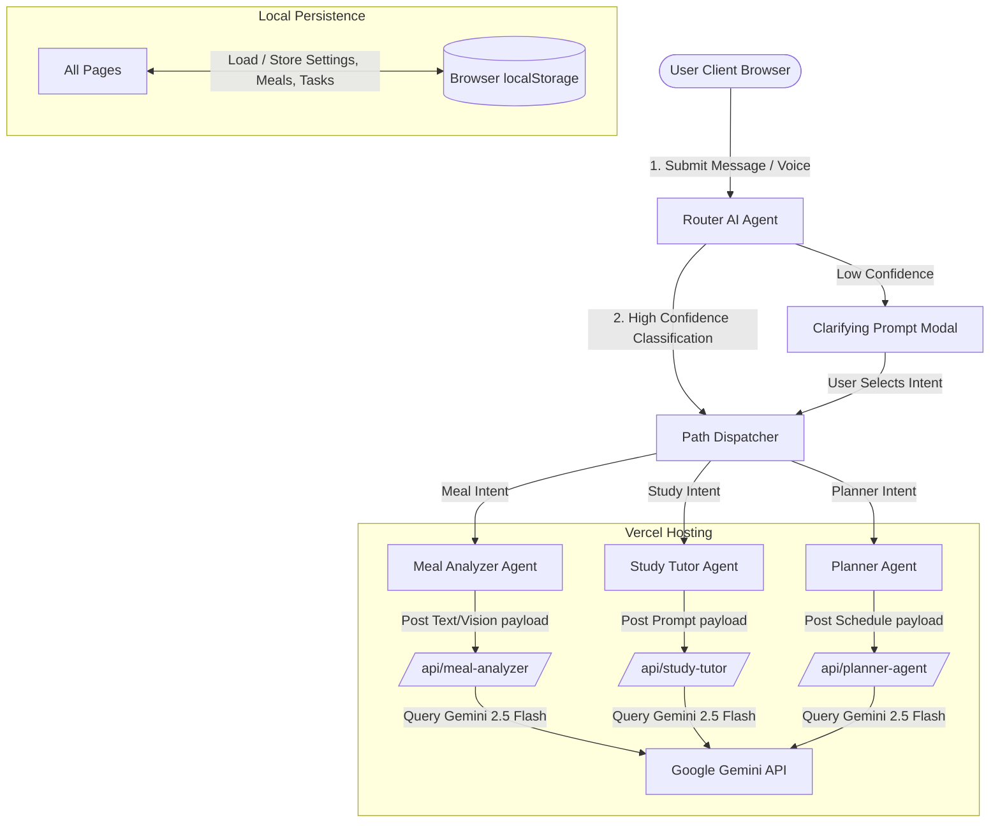

# LifeOS AI — Personal Productivity & Health Assistant

[](https://nextjs.org)
[](https://react.dev)
[](https://www.typescriptlang.org)
[](https://tailwindcss.com)
[](https://ai.google.dev)
[](https://vercel.com)
[](https://opensource.org/licenses/MIT)

**LifeOS AI** is a premium, personal productivity and health assistant that integrates the utility of ChatGPT, Notion, and Google Calendar into a single unified workspace. The platform features a central **Routing AI Agent** that dynamically redirects user requests to three specialized sub-agents: a **Meal Analyzer**, a **Study Tutor**, and a **Task Planner**.

To make it immediately testable for reviewers and portfolio visitors, the application is **fully login-free and local-first**. It persists all tasks, settings, focus timers, and nutrition history directly inside the user's browser `localStorage`, with serverless Next.js API routes handling AI reasoning via **Google Gemini 2.5 Flash**.

---

## Live Demo

🚀 **Try the Live Application:** [lifeos-eight-ivory.vercel.app](https://lifeos-eight-ivory.vercel.app) (No login or signup required!)

---

## System Architecture



---

## Core Features

### 1. Central Router Agent
* **Intent Routing**: Analyzes natural language queries (e.g., "I ate three eggs" or "remind me to pay bills tomorrow") and automatically redirects the user to the correct page with their request loaded.
* **Ambient Dialogues**: Asks clarifying questions if classification confidence falls below 75%.
* **Multimodal Actions**: Integrated **Web Speech API** for hands-free voice dictation (Speech-to-Text) and vocalized AI replies (Text-to-Speech).

### 2. Meal Analyzer (Vision + Nutrition)
* **Visual Food Log**: Drag-and-drop meal images (PNG/JPG/WEBP) for automated food recognition, macro calculations, and portion sizing.
* **Macronutrient Dashboard**: Interactive charts (Recharts) detailing Macro percentages, calories-by-food bars, and daily target calorie meters.
* **AI Coach Insights**: Real-time qualitative scoring and health adjustments (e.g., "Add greens to increase fiber", "Limit high-sodium items").

### 3. Study & Tutor AI
* **Interactive Tutor Chat**: Explains complex topics, provides analogical stories, and builds memorization mnemonics.
* **Spaced Repetition Deck**: Standardized flashcards compiling questions and answers with a 3D-flipping recall interface.
* **Focus Pomodoro Timer**: Visual ticking rings (25/5, 50/10, Custom) with a built-in browser AudioContext synth chime that logs focus metrics to user history.
* **Course Planner**: Generates 4-day revision timetables based on target dates and study hours.

### 4. Planning & Scheduler AI
* **Reminder Extraction**: Converts natural language lines to structured tasks (Date, Time, priority, categories).
* **AI Conflict Solver**: Optimizes schedules when allocating heavy task workloads by avoiding work/sleep hours and scheduling breaks.
* **Kanban & Calendar Views**: Full weekly/monthly calendar grids and drag-to-complete Kanban columns.

---

## Technology Stack

* **Frontend**: Next.js 16 (App Router), React 19, TypeScript, Tailwind CSS v4, Framer Motion, Recharts
* **Storage**: Browser `localStorage` (through client-side `mockDb` adapters)
* **AI Engine**: Google Gemini API (`gemini-2.5-flash`)
* **Hosting**: Vercel Serverless Platform

---

## Local Development Setup

### 1. Clone & Install
```bash
git clone https://github.com/Badarinath15122001/lifeos-ai.git
cd lifeos-ai
npm install
```

### 2. Configure Environment Variables
Create a `.env.local` file at the root of the project and insert your Gemini API Key:
```env
GEMINI_API_KEY=your_gemini_api_key_here
NEXT_PUBLIC_USE_FIREBASE_FUNCTIONS=false
```

### 3. Start Development Server
```bash
npm run dev
```
Open [http://localhost:3000](http://localhost:3000) to view the application locally.

---

## Verification & Validation

To ensure clean deployments, you can run lint and compilation checks locally:
```bash
# Verify ESLint syntax & formatting rules
npm run lint

# Verify type safety
npx tsc --noEmit
```

---

## License

This project is licensed under the MIT License - see the [LICENSE](LICENSE) file for details.

```text
MIT License

Copyright (c) 2026 Badarinath15122001

Permission is hereby granted, free of charge, to any person obtaining a copy
of this software and associated documentation files (the "Software"), to deal
in the Software without restriction, including without limitation the rights
to use, copy, modify, merge, publish, distribute, sublicense, and/or sell
copies of the Software, and to permit persons to whom the Software is
furnished to do so, subject to the following conditions:

The above copyright notice and this permission notice shall be included in all
copies or substantial portions of the Software.

THE SOFTWARE IS PROVIDED "AS IS", WITHOUT WARRANTY OF ANY KIND, EXPRESS OR
IMPLIED, INCLUDING BUT NOT LIMITED TO THE WARRANTIES OF MERCHANTABILITY,
FITNESS FOR A PARTICULAR PURPOSE AND NONINFRINGEMENT. IN NO EVENT SHALL THE
AUTHORS OR COPYRIGHT HOLDERS BE LIABLE FOR ANY CLAIM, DAMAGES OR OTHER
LIABILITY, WHETHER IN AN ACTION OF CONTRACT, TORT OR OTHERWISE, ARISING FROM,
OUT OF OR IN CONNECTION WITH THE SOFTWARE OR THE USE OR OTHER DEALINGS IN THE
SOFTWARE.
```
